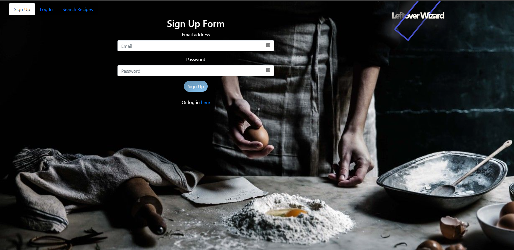
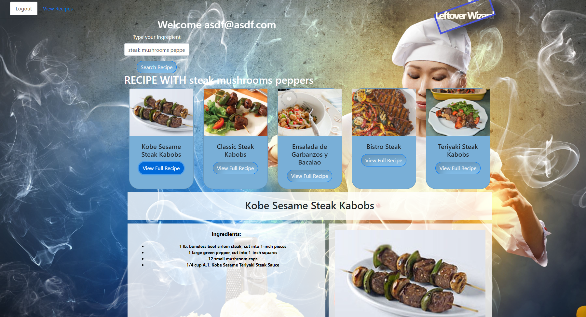
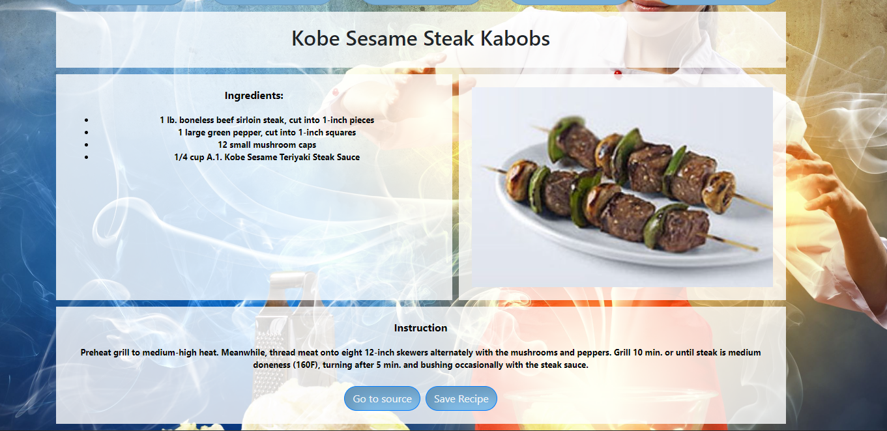
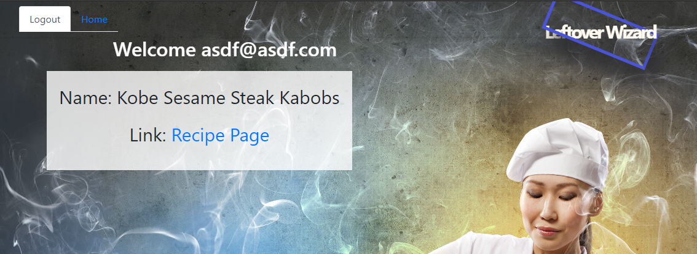

# Leftover Wizard
## Description
Don't feel like going out to eat for the umpteenth time this week? Want to make use of your pantry and fridge but don't know what to make? Leftover Wizard can help! Simply type in some ingredients you have and search and the webpage will display 5 recipes that you can make at home! Great for beginners to cooking or for practiced professionals. As a free user you can only search recipes, but if you sign up (it's free) you can view the recipe in full and save them to view later.
## Table of Contents
* [Description](#Description)
* [Installation](#Installation)
* [Usage](#Usage)
* [License](#License)
* [Collaborators](#Collaborators)
* [Example Images](#Examples)
* [Questions](#Questions)

## Installation
None! Simply go to this link here 
## Usage
As stated in the description, type in ingredients and hit search.
### License
MIT
### Collaborators
   
#### Example Images

#### Questions?
If you have questions regarding this program: 
Send me a message through GitHub:  
Or through email here: 
